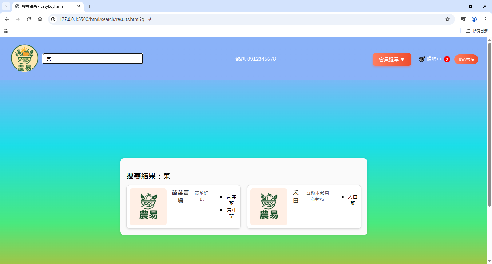

# EasyBuyFarm好農易電商平台

## 專案簡介
本專案為前後端分離的線上購物系統，支援三種使用者身分：  
- **一般使用者**：瀏覽賣場與商品，結帳前需登入或註冊  
- **買家**：完成購物流程，查看訂單，並可開通賣家功能  
- **賣家**：保留買家功能，並可建立與管理賣場與商品

## 專案背景與目標
- 農產品通路有限，傳統銷售仰賴實體市場 
- 本專案致力於建立小農電商平台，協助拓展線上銷售通路 
- 目標：提供安全、高效、友善的網購體驗 

## 使用者身分與操作流程
網頁依身分提供不同功能，形成完整購物與賣場管理體驗。

### 👤 一般使用者（未登入）

**操作流程：**  
首頁(賣場列表) → 商品列表 → 商品詳細頁 → 購物車 → 登入／註冊提示

**功能說明：**
- 可瀏覽賣場與商品資訊
- 可搜尋商品名稱，將會列出販售該商品的商店  
- 嘗試結帳時，系統要求登入或註冊

**畫面截圖：**
| 畫面 | 說明 |
|------|------|
|  | 賣場列表頁，未登入也可瀏覽 |
|  | 查看該賣場所有商品 |
|  | 採用模糊搜尋，找出含有關鍵字的賣場 |
|  | 查看商品資訊，可加入購物車但無法結帳 |
|  | 結帳時提示登入或註冊 |

### 🛒 買家

**操作流程：**  
1. 首頁(賣場列表) → 商品列表 → 商品詳細頁 → 購物車 → 結帳
2. 首頁(賣場列表) → 開通成為賣家

**功能說明：**
- 可將商品加入購物車並結帳  
- 查看訂單紀錄  
- 可開通賣家功能

**畫面截圖：**
| 畫面 | 說明 |
|------|------|
|  | 顯示已選購商品，可進行結帳 |
|  | 填寫付款方式並送出訂單 |
|  | 提供角色升級入口 |

---

### 🏪 賣家

**操作流程：**  
首頁(賣場列表) → 我的賣場 → 新增/修改/刪除賣場 → 新增/修改/刪除產品

**功能說明：**
- 建立與編輯賣場資訊
- 上架、修改或刪除商品  
- 保留買家功能，可同時購物與經營賣場  

**畫面截圖：**
| 畫面 | 說明 |
|------|------|
|  | 顯示個人擁有的賣場與賣場管理頁面，也可以新增賣場 |
|  | 可以針對特定賣場進行編輯 |
|  | 商品管理頁面，針對特定商品編輯/刪除，與新增該賣場的商品 |
|  | 新增商品 |

## 專案成員
方臆惟、張禎元、張祐祥、王士珉

## 個人貢獻
### 張祐祥
#### 會員系統
- 會員註冊
- 會員登入
- 會員中心
- 賣家開通
  
### 方臆惟
#### GitHub 帳號：[@LionFang0620](https://github.com/LionFang0620)
#### 賣場系統
- 瀏覽全部賣場
- 管理「我的賣場」
- 新增、編輯/刪除賣場
#### 商店系統
- 瀏覽商品列表與詳細頁面
- 新增、編輯/刪除商品
#### 團隊協作
- 引導團隊討論，整理系統流程與功能規劃
- 撰寫並維護分工表與時程計畫，協助進度管理
- 參與專案文件整理

### 王士珉
#### 訂單系統
- 購物車
- 會員下訂單
- 訂單詳細顯示
- 訂單檢視
#### 搜尋系統
- 商品搜尋
- 引導至賣場

### 張禎元
#### 其他功能
- 顧客問答
- 關於我們
- 隱私權政策
#### 前端架構建立
- 共用版面設計
- 配色與logo設計

## 使用技術與開發工具
- 開發語言：Java、HTML、CSS、JavaScript
- 框架：Spring Boot、Hibernate / JPA
- 資料庫：MySQL
- 架構模式：MVC + 分層設計（Controller / Service / DAO）
- 開發環境：Eclipse / VS Code
- 版本管理：GitHub

## 專案架構
### 前端專案架構

### 後端專案架構

## 安裝與運行指引
### 後端環境設定
1. 安裝 **JDK 17** 並設定環境變數  
2. 安裝並啟動 **MySQL** 資料庫  
   - 建立資料庫（可命名為 `easybuyfarm`）  
   - 預設帳號密碼：`root / 1234`  
3. 匯入本專案至 **Eclipse**  
4. 確認已安裝 **Spring Boot 外掛**，並執行專案  
   > 請確認 API URL 為 `http://localhost:8080`

### 前端環境設定
1. 下載[前端資料夾](./EasyBuyFarm_前端)至本機
2. 開啟 `index.html` 檔案即可運行 
   > 若後端在本機執行，請確認 API URL 為 `http://localhost:8080`
