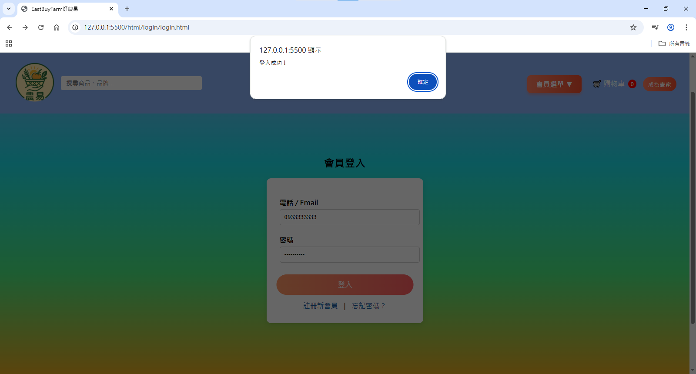
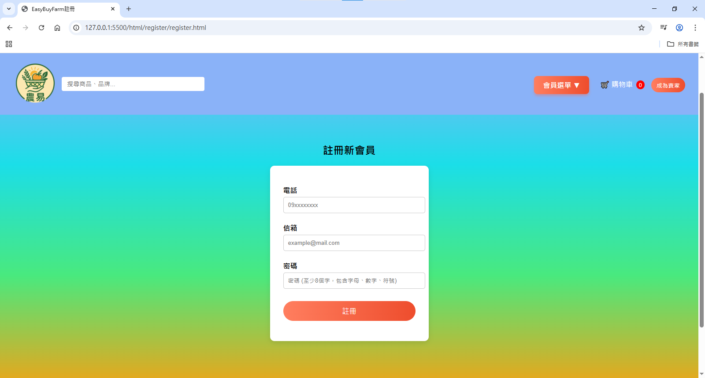
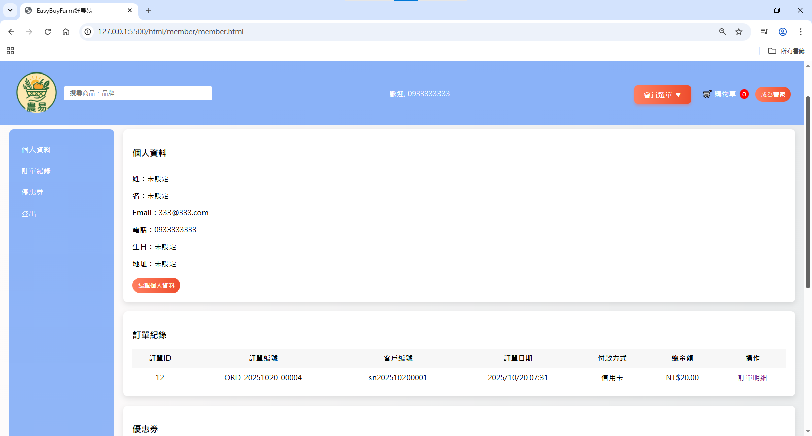
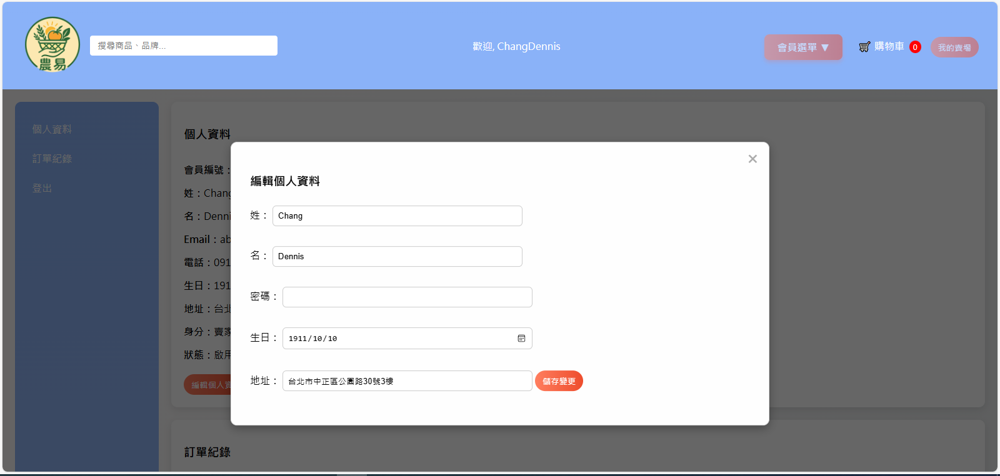
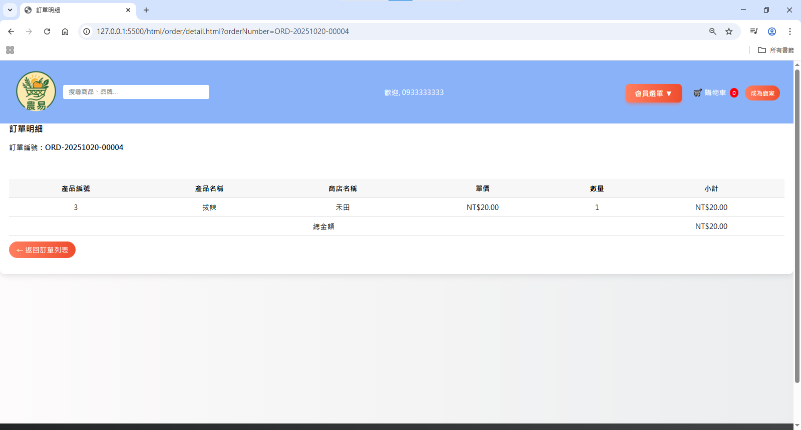

# EasyBuyFram好農易電商平台

## 專案簡介
農產品線上銷售與管理系統

## 專案背景與目標
- 農產品通路有限，傳統銷售仰賴實體市場。 
- 本專案致力於建立小農電商平台，協助拓展線上銷售通路。 
- 目標：提供安全、高效、友善的網購體驗。 

## 專案成員
方臆惟、張禎元、張祐祥、王士珉

## 平台功能列表
### 會員系統
#### 負責人：張祐祥
- 會員註冊
- 會員登入
- 會員中心
- 賣家開通

### 商店系統
#### 負責人：方臆惟
- 全部賣場
- 我的賣場
- 新增賣場
- 編輯/刪除賣場

### 產品系統
#### 負責人：方臆惟
- 商品列表
- 新增商品
- 編輯/刪除商品

### 訂單系統
#### 負責人：王士珉
- 購物車
- 會員下訂單
- 訂單詳細顯示
- 訂單檢視

### 搜尋系統
#### 負責人：王士珉
- 商品搜尋
- 引導至商店

### 其他功能
#### 負責人：張禎元
- 顧客問答
- 關於我們
- 隱私權政策

## 使用技術與開發工具
- 開發語言：Java、HTML、CSS、JavaScript
- 框架：Spring Boot、Hibernate / JPA
- 資料庫：MySQL
- 架構模式：MVC + 分層設計（Controller / Service / DAO）
- 開發環境：Eclipse / VS Code
- 版本管理：GitHub

## 專案架構
### 前端專案架構

### 後端專案架構

## 安裝與運行
1. 安裝 JDK 17 並設定環境變數
2. 使用 MySQL 建立資料庫
3. 下載專案擋匯入編譯器，並下載SpringBoot外掛程式
4. 下載前端檔案匯入電腦
5. 開啟Index.html

## 專案截圖
- 首頁：一般使用者可以瀏覽商店列表 

- 商品列表：點擊商店後，可看見該商店的所有商品 

- 商品詳細：點擊商品後，可看見該商品的詳細資訊，也可以經由這個頁面將商品放入購物車 

- 登入頁面：若有下單結帳的需求或是想要上架自己的商品，就需要登入 

- 註冊頁面：註冊帳號，註冊時可先只填寫電子郵件/電話/密碼 

- 會員中心：可以看見自己的會員資料與訂單紀錄 

- 編輯會員資料：可以編輯自己的會員資料 

- 檢視訂單明細：檢視訂單詳細 

